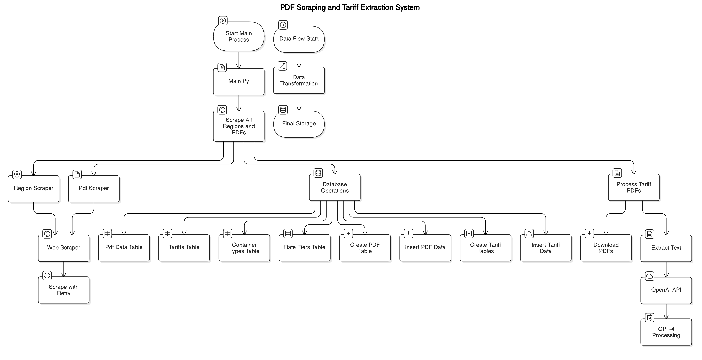

# PDF Scraper and Tariff Extraction System

This repository contains a comprehensive system for scraping, processing, and analyzing shipping container detention and demurrage tariff PDFs from shipping websites. The system automates the collection of PDF documents, extracts tariff information using AI, and stores the structured data in a SQLite database for further analysis.

## Features

- Web scraping of shipping container tariff PDFs by geographic regions
- Automated PDF text extraction
- AI-powered tariff data extraction using OpenAI's GPT-4
- Structured storage of tariff information in SQLite database
- Resilient scraping with automatic retries and error handling
- Comprehensive logging system

## System Architecture

The system consists of multiple components that work together:

1. **Web Scraping Module**: Scrapes regions and PDFs from the Hapag-Lloyd website
2. **PDF Processing Module**: Downloads PDFs and extracts text content
3. **Data Extraction Module**: Uses OpenAI's GPT-4 to extract structured tariff data
4. **Database Module**: Stores both PDF metadata and extracted tariff information

## Prerequisites

- Python 3.8+
- OpenAI API key
- FireCrawl API key 

## Setup and Installation

1. Clone the repository
2. Install required dependencies:
   ```
   pip install -r requirements.txt
   ```
3. Create a `.env` file with the following variables:
   ```
   API_KEY=your_firecrawl_api_key
   BASE_URL=https://www.hapag-lloyd.com/
   MAX_RETRIES=3
   RETRY_DELAY=2
   OPENAI_API_KEY=your_openai_api_key
   LOG_FILE=scraper.log
   ```

## Usage

Run the main script to start the scraping and extraction process:

```
python main.py
```

This will:
1. Scrape regions and PDFs from the shipping website
2. Store PDF metadata in the database
3. Download PDFs and extract text
4. Process the text to extract structured tariff data
5. Store the tariff data in the database

## Flow Diagram

For a visual representation of the system architecture and data flow, generate a flow diagram using the prompt provided in the repository.



## Database Schema

The database contains the following tables:

### PDF Data Table
- `id`: Primary key
- `region`: Geographic region
- `pdf_title`: Title of the PDF document
- `pdf_link`: URL to the PDF file

### Tariff Tables
1. **tariffs**: Main table for tariff information
   - `id`: Primary key
   - `area`: Geographic area
   - `country`: Country name
   - `charge_type`: Type of charge (e.g., Detention, Demurrage)
   - `port`: Port name
   - `currency`: Currency code

2. **container_types**: Container specifications linked to tariffs
   - `id`: Primary key
   - `tariff_id`: Foreign key to tariffs table
   - `type`: Container type (Dry, Reefer, Special)
   - `size`: Container size (20', 40', etc.)
   - `free_time_days`: Number of free days
   - `free_time_day_type`: Calendar or working days
   - `detention_days`: Detention period days
   - `detention_day_type`: Calendar or working days
   - `detention_rate`: Daily detention rate

3. **rate_tiers**: Progressive rate tiers for containers
   - `id`: Primary key
   - `container_type_id`: Foreign key to container_types table
   - `tier_name`: Name of the rate tier
   - `start_day`: Starting day for the tier
   - `end_day`: Ending day for the tier
   - `rate`: Rate amount
   - `rate_unit`: Unit for the rate (per day, etc.)

## Code Structure

- `main.py`: Entry point, orchestrates the scraping and processing workflow
- `src/scraping/`: Web scraping modules
  - `scraper.py`: Base web scraper using FireCrawl
  - `region_scraper.py`: Scraper for region information
  - `pdf_scraper.py`: Scraper for PDF documents
- `src/extraction/`: PDF processing and data extraction
  - `process_tarffic_pdfs.py`: PDF download and tariff extraction
- `src/database/`: Database operations
  - `database.py`: SQLite database setup and operations

## Component Details

### WebScraper (scraper.py)
A base scraper class that uses FireCrawl to extract HTML content from websites.

### RegionScraper (region_scraper.py)
Extracts region information from the shipping website, including region names and links.

### PdfScraper (pdf_scraper.py)
Extracts PDF links and titles from region-specific pages.

### Database Module (database.py)
Handles all database operations including table creation, data insertion, and retrieval.

### PDF Processing (process_tarffic_pdfs.py)
Handles downloading PDFs, extracting text, and using GPT-4 to extract structured tariff data.

### Main Script (main.py)
Orchestrates the entire workflow, including setting up logging, handling retries, and calling various components.

## Error Handling

The system implements robust error handling with:
- Automatic retries for transient network issues
- Comprehensive logging of all operations

## License

This project is licensed under the **Attribution-NonCommercial 4.0 International (CC BY-NC 4.0)** license.

You can view the full license here: [Creative Commons License](https://raw.githubusercontent.com/RitikChahar/Exaqube-Assignment-1/refs/heads/main/LICENSE?token=GHSAT0AAAAAADBBLO3ZPCTL37YWODX7U5BSZ742RSA)

## Contact

For any questions or concerns, please contact: **ritikchahar54@gmail.com**